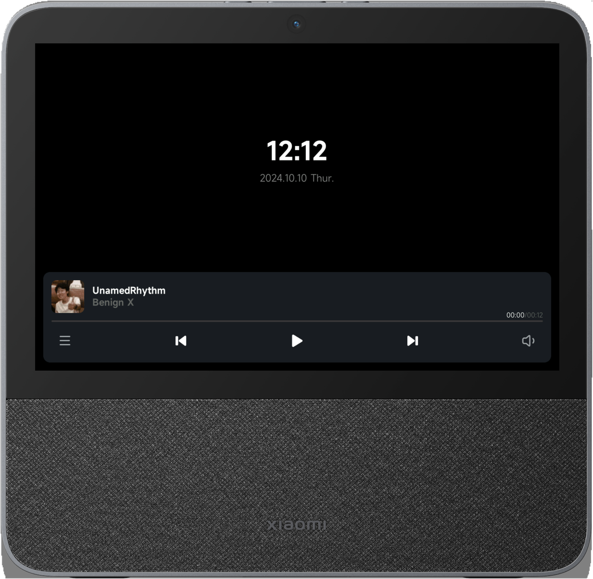
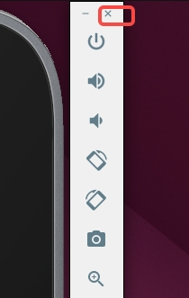

# Demo of music player

\[ English | [简体中文](Music_Player_Example_zh-cn.md) \]

## Introduction

This article describes how to run the music player demo on openvela Emulator.

## Prerequisites

1. Set up the development environment. Refer to [Environment Setup](../Getting_Started/Set_up_the_development_environment.md).

2. Download the source code. Refer to [Download openvela source code](../Getting_Started/Download_Vela_sources.md).

## Step 1: Configure the project

1. Switch to the root directory of openvela repository and execute the following command to configure the music player.

   > The emulator configuration file (defconfig) is in the “vendor/openvela/boards/vela/configs/goldfish-armeabi-v7a-ap/” directory, and the development board code is configured and compiled using “build.sh”.

   ```Bash
   ./build.sh vendor/openvela/boards/vela/configs/goldfish-armeabi-v7a-ap menuconfig
   ```

   - build.sh: A script for compilation used to configure and compile openvela code.
   - vendor/openvela/boards/vela/configs/\*：configuration path
   - menuconfig: Open the menuconfig page to modify the configuration of the project code.

   The following screen appears after execution:
   

2. Press the “/” key to search and modify the following configurations:

   ```Bash
   LVX_USE_DEMO_MUSIC_PLAYER=y
   LVX_MUSIC_PLAYER_DATA_ROOT="/data"
   ```

   1. Enter the configuration “LVX_USE_DEMO_MUSIC_PLAYER” to be searched. Fuzzy search is supported; for example, “music_player” will get the corresponding configuration. Press the Enter key to enter that configuration.
      

   2. Press the spacebar, and a \* that appears in [ ] indicates that the configuration is turned on.
      

   3. Set “LVX_MUSIC_PLAYER_DATA_ROOT” to “/data”, and press Enter to save the current configuration.
      

   4. Press the letter Q to bring up the exit Save screen as follows.
      

   5. Press the letter Y to save the configuration and exit the Modify Configuration page.

## Step 2: Compile the project

1. Switch to the root directory of openvela repository and execute the following commands one by one in a terminal:

   ```Bash
   # Clean up build artifacts
   ./build.sh vendor/openvela/boards/vela/configs/goldfish-armeabi-v7a-ap distclean -j$(nproc)

   # Start to build
   ./build.sh vendor/openvela/boards/vela/configs/goldfish-armeabi-v7a-ap -j$(nproc)
   ```

2. After successful execution, you will get the following files:

   ```
   ./nuttx
   ├── vela_ap.elf
   ├── vela_ap.bin
   ```

## Step 3: Launch the emulator and push resources

The font and image resources used by the music player are located in “apps/packages/demos/music_player/res”.To push these resources to the corresponding file paths mounted by the emulator, follow the steps below.

1. Switch to the root directory of openvela repository and start the emulator:

   ```Bash
   ./emulator.sh vela
   ```

2. Push resources to the device by using emulator-supported ADB. Open a new terminal in the root directory of openvela repository, type “adb push” followed by the file path to transfer the resources to the appropriate location.

   ```Bash
   #Install adb
   sudo apt install android-tools-adb

   #Push resources
   adb push apps/packages/demos/music_player/res /data/
   ```

## Step 4: Start the music player

Enter the following command in the emulator's terminal environment “openvela-ap”:

```Bash
music_player &
```



## Step 5: Exit Demo

Shut down the emulator to exit Demo, as shown below:



## FAQ

### How to customize the music player?

1. Modify the configuration under “apps/packages/demos/music_player/res” to add new music media files in the “res/musics” directory. Only the “\_.wav” format is currently supported. You can convert file formats “_.mp3/aac/m4a” to “\*.wav”.Then, modify the “res/musics/manifest.json” file in that directory:

    ```JSON
    {
      "musics": [
        {
          "path": "UnamedRhythm.wav",
          "name": "UnamedRhythm",
          "artist": "Benign X",
          "cover": "UnamedRhythm.png",
          "total_time": 12000,
          "color": "#114514"
        }
      ]
    }
    ```

   | Parameters                      | Description of parameters                                                                         |
   | :------------------------------ | :------------------------------------------------------------------------------------------------ |
   | path                            | File path of the media item to be played                                                          |
   | name                            | Name of the media item                                                                            |
   | artist                          | Name of the artist                                                                                |
   | cover                           | Cover path. If no cover is provided, the cover will be displayed. |
   | total_time | The total playing duration of the media item in “milliseconds”.                   |
   | color                           | Theme color, not currently used.                                                  |

   Refer to the format. Add the media item you want to play to that configuration file.

   For example, to add music “Happiness.wav” with a playing time of 186,507 ms, you can modify it as follows.

   ```JSON
   {
     "musics": [
       {
         "path": "UnamedRhythm.wav",
         "name": "UnamedRhythm",
         "artist": "Benign X",
         "cover": "UnamedRhythm.png",
         "total_time": 12000,
         "color": "#114514"
       },
       {
         "path": "Happiness.wav",
         "name": "Xin",
         "artist": "Tang",
         "cover": "Good.png",
         "total_time": 186507,
         "color": "#252525"
       },
     ]
   }
   ```

   After modifying the configuration, you need to push resources again by executing the following command:

    ```Bash
    # Push resources
    adb push apps/packages/demos/music_player/res /data/
    ```

2. Exit the emulator.

3. Execute [Step 3](#step-3-launch-the-emulator-and-push-resources) and [Step 4](#step-4-start-the-music-player) again.
