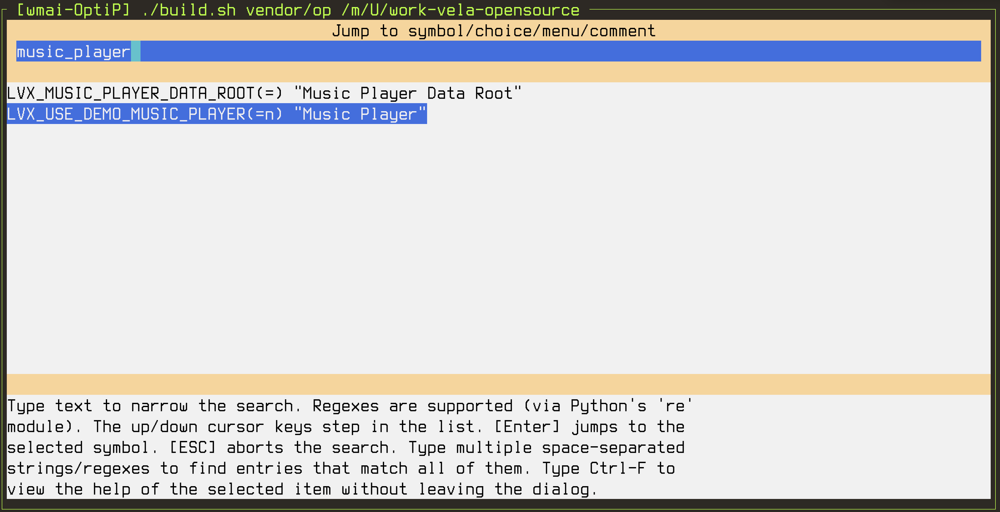

# 音乐播放器Demo

\[ [English](Music_Player_Example.md) | 简体中文 \]

## 简介

本文介绍如何在 openvela Emulator 中运行音乐播放器Demo。

## 前提条件

1. 搭建开发环境，请参见[环境搭建](../Getting_Started/Set_up_the_development_environment_zh-cn.md)。

2. 下载源码，请参见[下载 openvela 源码](../Getting_Started/Download_Vela_sources_zh-cn.md)。

## 步骤一 配置项目

1. 切换到 openvela 仓库的根目录，执行如下命令来配置音乐播放器。
    > 模拟器配置文件（defconfig）在 `vendor/openvela/boards/vela/configs/goldfish-armeabi-v7a-ap/` 目录下，使用 `build.sh` 配置和编译开发板的代码。

    ```Bash
    ./build.sh vendor/openvela/boards/vela/configs/goldfish-armeabi-v7a-ap menuconfig
    ```

    - build.sh：编译脚本，用来配置和编译 openvela 代码
    - vendor/openvela/boards/vela/configs/*：配置路径
    - menuconfig：打开 menuconfig 页面，修改项目代码的配置。

    执行后出现如下界面：
    

2. 按下 `/` 键逐个搜索修改如下配置：

    ```Bash
    LVX_USE_DEMO_MUSIC_PLAYER=y
    LVX_MUSIC_PLAYER_DATA_ROOT="/data"
    ```

    1. 输入待搜索的配置 `LVX_USE_DEMO_MUSIC_PLAYER`，支持模糊搜索，例如 `music_player`，找到对应的配置，按回车键进入该配置。
    

    2. 按下空格键，`[ ]` 中出现 `*` 表示打开该配置。
    

    3. 将 `LVX_MUSIC_PLAYER_DATA_ROOT` 设置为 `/data`，修改后按下回车键保存当前配置项。
    

    4. 按下 `Q` 键，弹出如下退出保存界面。
    

    5. 按下字母`Y` 键保存配置，退出修改配置页面。

## 步骤二 编译项目

1. 切换到 openvela 仓库的根目录，在终端内依次执行如下命令：
   
    ```Bash
    # 清理构建产物
    ./build.sh vendor/openvela/boards/vela/configs/goldfish-armeabi-v7a-ap distclean -j$(nproc)

    # 开始构建
    ./build.sh vendor/openvela/boards/vela/configs/goldfish-armeabi-v7a-ap -j$(nproc)
    ```

2. 成功执行后，将得到以下文件：

    ```
    ./nuttx
    ├── vela_ap.elf
    ├── vela_ap.bin
    ```

## 步骤三 启动模拟器并推送资源
音乐播放器运行中会使用到的字体和图片资源位于`apps/packages/demos/music_player/res`中。要将这些资源推送到模拟器挂载的相应文件路径，可以按照以下步骤操作。

1. 切换到 openvela 仓库的根目录，启动模拟器：

    ```Bash
    ./emulator.sh vela
    ```

2. 使用模拟器支持的 ADB 将资源推送到设备，在 openvela 仓库的根目录下打开一个新的终端，输入 adb push 后跟文件路径，即可将资源传输到相应位置。

    ```Bash
    # 安装adb
    sudo apt install android-tools-adb

    # 推送资源
    adb push apps/packages/demos/music_player/res /data/
    ```

## 步骤四 启动音乐播放器

在模拟器的终端环境 `openvela-ap>` 中输入如下命令：

```Bash
music_player &
```


## 步骤五 退出 Demo

关闭模拟器退出 Demo，如下图所示：


## 常见问题

### 如何自定义音乐播放器

1. 修改 `apps/packages/demos/music_player/res` 下面的相关配置，在 `res/musics` 目录下增加新的音乐媒体文件，格式目前只支持 `*.wav`，可以自行将 `*.mp3/aac/m4a` 等格式的媒体文件转换为 `*.wav` 格式。然后修改该目录下的 `res/musics/manifest.json` 文件：

    ```JSON
    {
      "musics": [
        {
          "path": "UnamedRhythm.wav",
          "name": "UnamedRhythm",
          "artist": "Benign X",
          "cover": "UnamedRhythm.png",
          "total_time": 12000,
          "color": "#114514"
        }
      ]
    }
    ```

    | 参数       | 参数说明                                 |
    | :--------- | :--------------------------------------- |
    | path       | 待播放媒体的文件路径                     |
    | name       | 媒体名                                   |
    | artist     | 艺术家名                                 |
    | cover      | 封面路径，如果没有提供封面，会展示封面。 |
    | total_time | 该媒体的总播放时长，单位为 `毫秒`。      |
    | color      | 主题色，目前还没有使用。                 |

    参考该格式，将想要播放的媒体添加到该配置文件中。

    例如：添加一个，`Happiness.wav` 播放时长为 `186,507 ms` 的音乐，可以按如下方式修改。

    ```JSON
    {
      "musics": [
        {
          "path": "UnamedRhythm.wav",
          "name": "UnamedRhythm",
          "artist": "Benign X",
          "cover": "UnamedRhythm.png",
          "total_time": 12000,
          "color": "#114514"
        },
        {
          "path": "Happiness.wav",
          "name": "Xin",
          "artist": "Tang",
          "cover": "Good.png",
          "total_time": 186507,
          "color": "#252525"
        },
      ]
    }
    ```

    修改完配置后，需要重新推送资源，执行如下命令：

    ```Bash
    # 推送资源
    adb push apps/packages/demos/music_player/res /data/
    ```

2. 退出模拟器。

3. 重新执行[步骤三](#步骤三-启动模拟器并推送资源)和[步骤四](#步骤四-启动音乐播放器)。