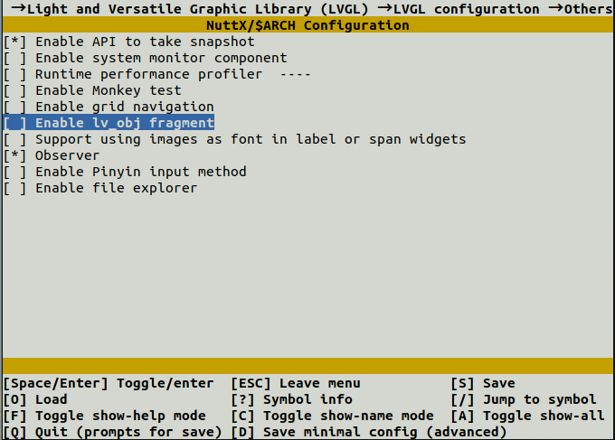

# Bracelet Bandx Demo

\[ English | [简体中文](Smart_Band_Example_zh-cn.md) \]

## Introduction
Bandx is a smart band demo, including watch face, launcher, music, heart rate, stopwatch, sleep, exercise, settings, flashlight, with a resolution of 194*368. You can learn more details about bandx in the `apps/packages/demos/bandx/` directory.

This article describes how to run the example on the openvela Emulator.

## Prerequisites

1. Build the development environment, see [Environment Build](../Getting_Started/Set_up_the_development_environment_zh-cn.md).

2. Download the source code, please refer to [Download openvela source code](../Getting_Started/Download_Vela_sources_zh-cn.md).

## Step 1 Configure the project

1. Switch to the root directory of the openvela repository and execute the following command to configure the Bandx wristband.
    > The simulator configuration file (defconfig) is in the `vendor/openvela/boards/vela/configs/goldfish-armeabi-v7a-ap/` directory. Use `build.sh` to configure and compile the simulator code.

    ```Bash
    ./build.sh vendor/openvela/boards/vela/configs/goldfish-armeabi-v7a-ap menuconfig
    ```

    - build.sh: compilation script, used to configure and compile openvela code
    - vendor/openvela/boards/vela/configs/goldfish-armeabi-v7a-ap: configuration path
    - menuconfig: open the menuconfig page and modify the configuration of the project code.

    After execution, the following interface appears:

    

2. Press the `/` key to search and modify the following configuration items one by one:

    ```Bash
    LV_USE_FRAGMENT = y
    LVX_USE_DEMO_BANDX = y
    BANDX_BASE_PATH = "/data"
    ```
    > Take LV_USE_FRAGMENT as an example, and the rest of the configuration is the same.

    1. Enter the configuration to be searched.

        

    2. Press `Enter` to enter the configuration page.

        

    3. Press the `Enter` key to open the configuration. `*` appears in `[ ]` to indicate that the configuration is opened.

        

    4. Press the `/` key to continue searching for the remaining configurations, and modify the remaining configurations according to the above steps.

    5. Press the letter `Q` key, and the following exit save interface will pop up.

        

    6. Press the letter `Y` key to save the configuration and exit the configuration modification page.

## Step 2 Compile the project

1. Switch to the root directory of the openvela repository and execute the following commands in the terminal in sequence:

    - -j16: Indicates using 16 threads to compile the code in parallel to speed up the compilation speed.

    ```Bash
    # Clean up build products
    ./build.sh vendor/openvela/boards/vela/configs/goldfish-armeabi-v7a-ap distclean -j16

    # Start building
    ./build.sh vendor/openvela/boards/vela/configs/goldfish-armeabi-v7a-ap -j16
    ```

2. After successful execution, the following files will be obtained:

    ```Bash
    ./nuttx
    ├── vela_ap.elf
    ├── vela_ap.bin
    ```

## Step 3 Start the simulator and push resources

The font and image resources used in Bandx are located in `apps/packages/demos/bandx/resources/`. To push these resources to the corresponding file path mounted by the simulator, you can follow the steps below.

1. Switch to the root directory of the openvela repository and start the emulator:

    ```bash
    ./emulator.sh vela
    ```

2. Use `ADB` supported by the emulator to push resources to the device. Open a new terminal in the root directory of the openvela repository and enter `adb push` followed by the file path to transfer the resources to the corresponding location.

    ```bash
    # Install adb
    sudo apt install android-tools-adb

    # Push resources
    adb push apps/packages/demos/bandx/resource/font/assets/* /data/font/
    adb push apps/packages/demos/bandx/resource/image/assets /data/image/
    ```

    > If `BANDX_BASE_PATH` is changed to a non-default value, such as `/tmp`, the resource files must also be transferred to the `/tmp/font/` and `/tmp/image/` directories. Otherwise, an error that the resource cannot be found will occur.

## Step 4 Launch Bandx

1. Enter the following command in the simulator's terminal environment `openvela-ap>`:

    ```powershell
    bandx &
    ```

    

2. To access the Launcher interface, swipe `from right to left`. Click different icons to navigate to sub-pages, such as the Heart Rate page shown below. To exit the page, swipe `from left to right`.

    > Note: The music page is just a UI display, and there is no actual audio access.

    

3. Turn on `Auto-show` in settings to automatically play the entire application; turn off `Auto-show` to end the automatic playback.

## Step 5 Exit Demo

Close the simulator and exit Demo, as shown below:


## FAQ
### 1 adb command not found

#### Reason
The `adb` tool is not installed.

#### Solution
Install `adb` and execute the following command:

``` Bash
sudo apt install android-tools-adb
```

### 2 Fonts are displayed as garbled characters

#### Reason
Font resources are not loaded correctly.

#### Solution
Please press [Step 3](#step-3-start-the-simulator-and-push-resources) to push resources.