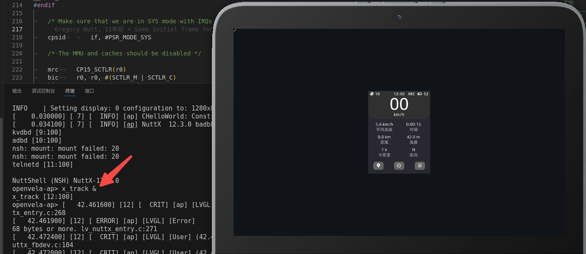
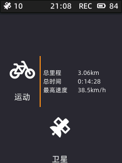

# 自行车码表示例

\[ [English](X_Track.md) | 简体中文 \]

## 简介

`X-TRACK Demo` 移植自开源项目 [X-TRACK](https://github.com/FASTSHIFT/X-TRACK)，感谢 X-TRACK 原作者 FASTSHIFT 本人完成该移植工作。

它是一个自行车码表，拥有时速显示、路程统计和实时轨迹显示等功能，显示分辨率为 `240x320`，使用触摸屏交互。

代码目录位于：`apps/packages/demos/x_track`

本文介绍如何在 openvela Emulator 上运行该示例。

## 前提条件

1. 搭建开发环境，请参见[环境搭建](../Getting_Started/Set_up_the_development_environment_zh-cn.md)。

2. 下载源码，请参见[下载 openvela 源码](../Getting_Started/Download_Vela_sources_zh-cn.md)。

## 步骤一 配置项目

1. 切换到 openvela 仓库的根目录，运行以下命令打开编译配置项目：

    ```Bash
    ./build.sh vendor/openvela/boards/vela/configs/goldfish-armeabi-v7a-ap menuconfig
    ```

2. 依次修改如下配置。

    ```Bash
    LIB_PNG = y
    LV_USE_LIBPNG = y
    NETUTILS_CJSON = y
    UIKIT = y
    UIKIT_FONT_MANAGER = y
    LVX_USE_DEMO_X_TRACK = y
    ```

    > 以启用`LIB_PNG`配置为例进行说明，其他配置操作相同。
    1. 按键盘上的 `/` 按键进入搜索模式，在搜索栏输入`LIB_PNG`，使用方向键移动光标至`LIB_PNG`，按回车确认。

        


    2. 在`Enable libpng`选项上按`空格键`将此选项开启，`[ ]` 中出现 `*` 表示该配置被打开。

        

    3. 其余配置项的开启方法同上。

## 步骤二 开始编译

1. 运行以下命令开始编译：

    ```Bash
    # 清理构建产物
    ./build.sh vendor/openvela/boards/vela/configs/goldfish-armeabi-v7a-ap distclean -j$(nproc)

    # 开始构建
    ./build.sh vendor/openvela/boards/vela/configs/goldfish-armeabi-v7a-ap -j$(nproc)
    ```

2. 编译成功后，在`nuttx`目录下会生成以下文件。

    ```Bash
    ./nuttx
    ├── vela_ap.elf
    ├── vela_ap.bin
    ```

## 步骤三 启动模拟器并推送资源

1. 切换到 openvela 仓库的根目录，启动模拟器：

    ```Bash
    ./emulator.sh vela
    ```

2. 使用模拟器支持的 `ADB` 将资源推送到设备，在 openvela 仓库的根目录下打开一个新的终端，输入 `adb push` 后跟文件路径，即可将资源传输到相应位置。

    ```Bash
    # 安装adb
    sudo apt install android-tools-adb

    # 推送资源
    adb push apps/packages/demos/x_track/resource/font /data
    adb push apps/packages/demos/x_track/resource/images /data
    adb push apps/packages/demos/x_track/resource/track /data
    ```

## 步骤四 启动

### 1 开机页面

1. 启用 `X-TRACK` 程序，在模拟器的终端环境 `openvela-ap>` 中输入如下命令：
    ```Bash
    x_track &
    ```

2. 执行后效果如下图所示：
    

### 2 主界面


下方三个功能按钮，分别对应跳转不同的功能页面：

1. 运动轨迹页面

    此页面左下角显示了当前运动的基本信息，中间部分显示当前的运动方向和走过的轨迹，右划可返回上一页。

    


2. 关机页面

    此页面模仿了手机的关机页面，按住黄色滚动条往上拖到底再松手即可关机，点击其他位置或右划可返回上一页。

    

3. 系统信息页面

    此页面显示了更为详细的系统信息，上下划动或者点击对应的图标可切换不同的信息展示，右划可返回上一页。

    

## 步骤五 退出 Demo

关闭模拟器退出 Demo，如下图所示：


## 常见问题

### 1. adb 命令找不到

#### 原因

未安装 `adb` 工具。

#### 解决方案

安装 `adb`，执行如下命令：

```bash
sudo apt install android-tools-adb
```

### 2. 字体显示为乱码

#### 原因

未正确加载字体资源。

#### 解决方案

请按[步骤三](#步骤三-启动模拟器并推送资源)进行资源推送。

### 3. 为什么没有地图显示功能

#### 原因

商用地图资源存在版权问题，所以无法提供地图功能，只保留轨迹显示功能。

### 4. 为什么和原版的 UI 不一样

#### 原因

此 Demo 基于原版的代码进行了大幅度调整，所以功能和显示上稍有区别。

### 5. 为什么右上角状态栏电量一直在随机跳动

#### 原因

在模拟器上使用的是简单的随机数模拟电量，所以是正常现象。

### 6. 这个轨迹是模拟的吗

#### 原因

是的，它通过读取 [GPX](https://zh.wikipedia.org/wiki/GPX) 文件进行轨迹重放，模拟GNSS产生数据。

### 7. 怎么替换显示自己的轨迹文件

#### 解决方案

将您的轨迹文件（GPX格式），重命名为 `TRK_EXAMPLE.gpx`，用 `adb` 工具推送到 `/data/Track` 目录即可。